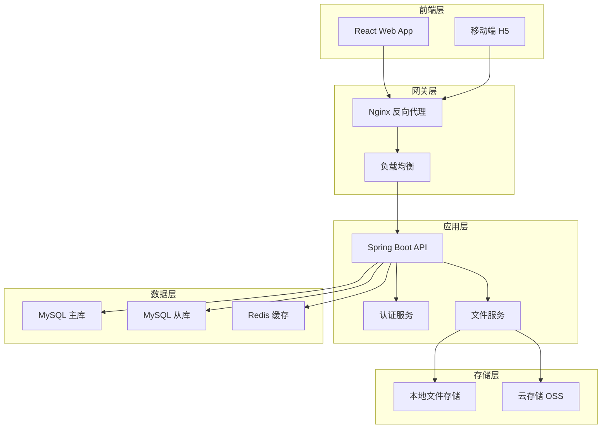
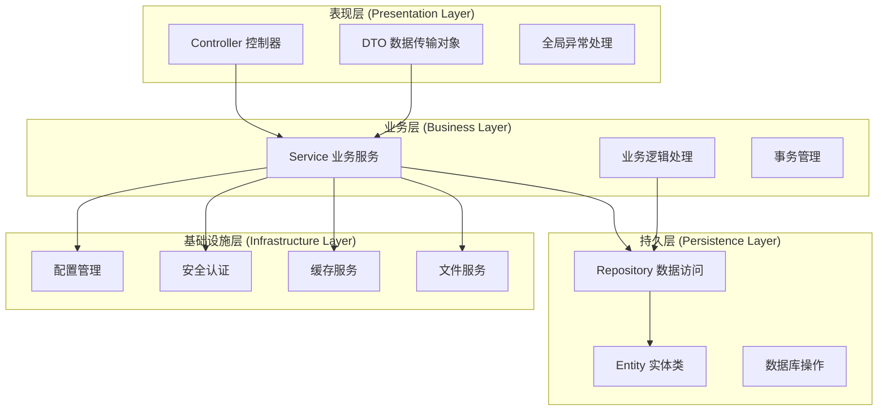
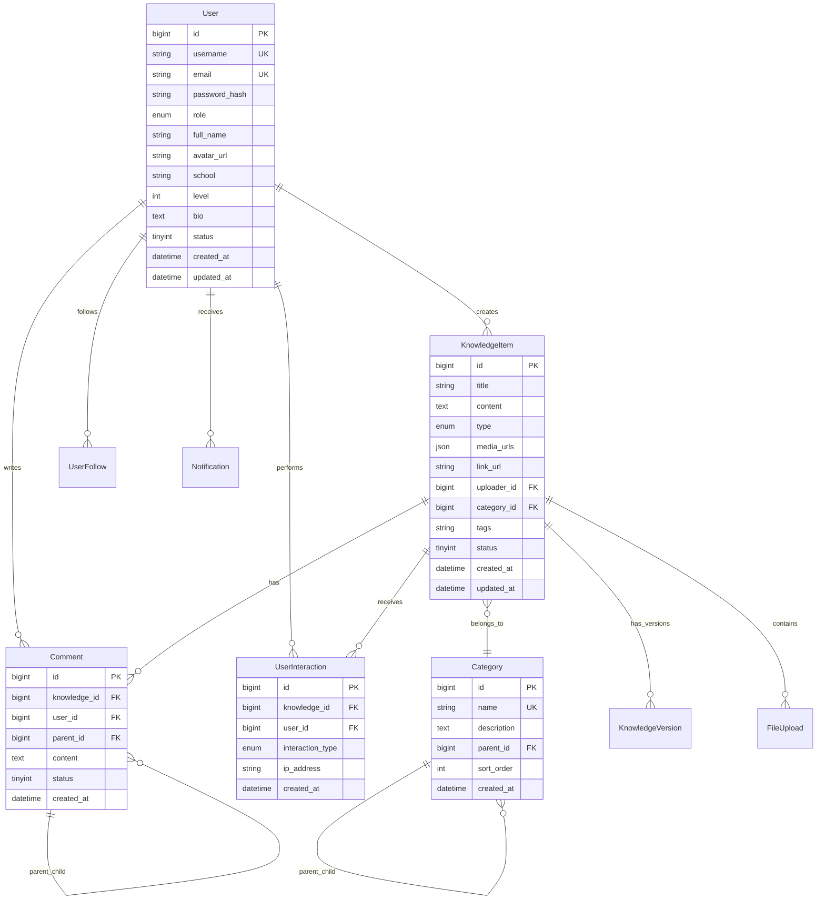

# EduChain 教育知识共享平台设计文档

## 概述

EduChain是一个现代化的教育知识共享平台，采用前后端分离架构，为学习者和教育者提供便捷的知识分享、交流和学习环境。平台支持多种类型的知识内容，包括文本、图片、视频、PDF等多媒体内容，并提供完整的用户互动、搜索推荐、通知系统等功能。

### 技术栈
- **前端**: React 18 + TypeScript + Vite + Ant Design
- **后端**: Spring Boot 3.x + Spring Security + Spring Data JPA
- **数据库**: MySQL 8.0 + Redis (缓存)
- **文件存储**: 本地存储/阿里云OSS
- **部署**: Docker + Nginx

## 架构设计

### 系统架构图



### 分层架构



## 组件和接口设计

### 核心组件

#### 1. 用户管理组件 (User Management)

**职责**: 处理用户注册、登录、个人信息管理、权限控制

**主要类**:
- `UserController`: 用户相关API接口
- `UserService`: 用户业务逻辑
- `UserRepository`: 用户数据访问
- `User`: 用户实体类
- `UserStats`: 用户统计实体

**关键接口**:
```java
public interface UserService {
    UserDTO register(RegisterRequest request);
    LoginResponse login(LoginRequest request);
    UserDTO updateProfile(Long userId, UpdateProfileRequest request);
    void changePassword(Long userId, ChangePasswordRequest request);
    UserStatsDTO getUserStats(Long userId);
}
```

#### 2. 知识内容管理组件 (Knowledge Management)

**职责**: 处理知识内容的创建、编辑、删除、查询、版本管理

**主要类**:
- `KnowledgeItemController`: 知识内容API接口
- `KnowledgeItemService`: 知识内容业务逻辑
- `KnowledgeItemRepository`: 知识内容数据访问
- `KnowledgeItem`: 知识内容实体
- `KnowledgeVersion`: 版本历史实体

**关键接口**:
```java
public interface KnowledgeItemService {
    KnowledgeItemDTO create(CreateKnowledgeRequest request);
    KnowledgeItemDTO update(Long id, UpdateKnowledgeRequest request);
    void delete(Long id);
    Page<KnowledgeItemDTO> findAll(Pageable pageable, KnowledgeFilter filter);
    KnowledgeItemDTO findById(Long id);
}
```

#### 3. 互动管理组件 (Interaction Management)

**职责**: 处理用户互动行为，包括点赞、收藏、评论、关注

**主要类**:
- `UserInteractionController`: 用户互动API
- `UserInteractionService`: 互动业务逻辑
- `CommentService`: 评论业务逻辑
- `UserFollowService`: 关注业务逻辑

**关键接口**:
```java
public interface UserInteractionService {
    void like(Long userId, Long knowledgeId);
    void unlike(Long userId, Long knowledgeId);
    void favorite(Long userId, Long knowledgeId);
    void unfavorite(Long userId, Long knowledgeId);
    InteractionStatsDTO getStats(Long knowledgeId);
}
```

#### 4. 搜索推荐组件 (Search & Recommendation)

**职责**: 提供全文搜索、智能推荐、热门内容等功能

**主要类**:
- `SearchController`: 搜索API接口
- `SearchService`: 搜索业务逻辑
- `RecommendationService`: 推荐算法
- `SearchIndexService`: 搜索索引管理

**关键接口**:
```java
public interface SearchService {
    Page<KnowledgeItemDTO> search(SearchRequest request);
    List<String> getSuggestions(String keyword);
    List<HotKeywordDTO> getHotKeywords();
    List<KnowledgeItemDTO> getRecommendations(Long userId);
}
```

### 数据模型

#### 核心实体关系图



## 正确性属性

*属性是一个特征或行为，应该在系统的所有有效执行中保持为真——本质上是关于系统应该做什么的正式声明。属性作为人类可读规范和机器可验证正确性保证之间的桥梁。*

基于需求分析，以下是系统必须满足的正确性属性：

### 属性 1: 用户注册唯一性
*对于任何*有效的用户注册请求，系统应该验证用户名和邮箱的唯一性，成功时创建用户记录，失败时返回适当的错误信息
**验证需求: 1.1**

### 属性 2: 登录凭据验证
*对于任何*登录请求，系统应该验证用户凭据的正确性，成功时生成有效的JWT令牌，失败时拒绝访问
**验证需求: 1.2, 1.3**

### 属性 3: 用户信息更新一致性
*对于任何*用户信息更新请求，系统应该验证数据有效性并保持数据一致性，更新成功后数据库中的信息应该与请求一致
**验证需求: 1.4**

### 属性 4: 用户权限控制
*对于任何*被禁用的用户，系统应该阻止其访问需要认证的功能，确保权限控制的有效性
**验证需求: 1.5**

### 属性 5: 知识内容创建完整性
*对于任何*知识内容创建请求，系统应该验证内容格式和必填字段，成功创建后内容应该在数据库中正确保存
**验证需求: 2.1**

### 属性 6: 文件上传安全性
*对于任何*文件上传请求，系统应该验证文件类型、大小限制和安全性，通过验证的文件应该生成唯一的访问URL
**验证需求: 2.2, 7.1, 7.2**

### 属性 7: 内容版本管理
*对于任何*知识内容编辑操作，系统应该创建版本历史记录，确保内容变更的可追溯性
**验证需求: 2.3**

### 属性 8: 软删除一致性
*对于任何*删除操作，系统应该使用软删除机制，被删除的内容状态应该标记为删除但数据仍然保留
**验证需求: 2.4**

### 属性 9: 标签关联统计
*对于任何*标签添加操作，系统应该正确关联内容与标签，并更新标签使用统计
**验证需求: 2.5**

### 属性 10: 分类层级完整性
*对于任何*分类创建操作，系统应该维护分类的层级结构完整性，子分类应该正确关联到父分类
**验证需求: 3.1, 3.2**

### 属性 11: 分类统计准确性
*对于任何*内容分类关联操作，系统应该准确更新分类下的内容统计数量
**验证需求: 3.3, 3.5**

### 属性 12: 分类依赖检查
*对于任何*分类删除操作，系统应该检查是否存在依赖的内容，并正确处理依赖关系
**验证需求: 3.4**

### 属性 13: 互动统计实时性
*对于任何*用户互动操作（点赞、收藏、浏览），系统应该实时更新相关的统计数据
**验证需求: 4.1, 4.2, 4.3, 9.1**

### 属性 14: 评论层级关系
*对于任何*评论回复操作，系统应该正确建立评论的层级关系，并触发相应的通知
**验证需求: 4.4, 4.5**

### 属性 15: 全文搜索准确性
*对于任何*搜索请求，系统应该在标题、内容和标签中进行全文搜索，返回相关的结果
**验证需求: 5.1**

### 属性 16: 搜索筛选正确性
*对于任何*带分类筛选的搜索请求，返回的结果应该只包含指定分类下的内容
**验证需求: 5.2**

### 属性 17: 搜索统计更新
*对于任何*搜索操作，系统应该更新关键词搜索统计并提供相关建议
**验证需求: 5.3**

### 属性 18: 搜索结果排序
*对于任何*搜索结果，系统应该按照相关性和热度进行合理排序
**验证需求: 5.5**

### 属性 19: 通知触发机制
*对于任何*触发通知的操作（点赞、评论、关注），系统应该为相关用户创建适当的通知
**验证需求: 6.1, 6.2, 6.3, 6.4**

### 属性 20: 通知状态管理
*对于任何*通知查看操作，系统应该正确更新通知的已读状态
**验证需求: 6.5**

### 属性 21: 文件访问权限
*对于任何*文件访问请求，系统应该验证用户权限并提供适当的访问控制
**验证需求: 7.4**

### 属性 22: 关注关系管理
*对于任何*关注/取消关注操作，系统应该正确维护用户间的关注关系和统计数据
**验证需求: 8.1, 8.2**

### 属性 23: 关注动态通知
*对于任何*被关注用户的新内容发布，系统应该通知所有关注者
**验证需求: 8.3**

### 属性 24: 统计数据准确性
*对于任何*统计查询，系统应该返回准确的统计数据，包括浏览量、点赞数、收藏数等指标
**验证需求: 9.2, 9.3**

### 属性 25: 评分计算合理性
*对于任何*内容评分计算，系统应该基于多项指标计算合理的质量分数
**验证需求: 9.4**

### 属性 26: 外部内容抓取
*对于任何*外部内容抓取操作，系统应该按配置频率执行，并通过哈希避免重复抓取
**验证需求: 10.1, 10.2, 10.3**

### 属性 27: 成就系统触发
*对于任何*用户行为，系统应该检查成就条件并在满足时授予相应成就和积分
**验证需求: 11.1, 11.2**

### 属性 28: 等级计算准确性
*对于任何*用户等级计算，系统应该基于积分和活跃度准确确定用户等级
**验证需求: 11.4, 11.5**

### 属性 29: 操作日志完整性
*对于任何*重要操作，系统应该记录完整的操作日志，包含用户、时间、操作内容等信息
**验证需求: 12.1**

### 属性 30: 异常处理机制
*对于任何*系统错误或异常行为，系统应该记录相应日志并采取适当的防护措施
**验证需求: 12.2, 12.3**

## 错误处理

### 异常分类

1. **业务异常 (BusinessException)**
   - 用户名已存在
   - 内容不存在
   - 权限不足
   - 操作频率限制

2. **验证异常 (ValidationException)**
   - 参数格式错误
   - 必填字段缺失
   - 数据长度超限
   - 文件类型不支持

3. **系统异常 (SystemException)**
   - 数据库连接失败
   - 文件上传失败
   - 外部服务调用失败
   - 内存不足

### 错误响应格式

```json
{
  "success": false,
  "code": "USER_NOT_FOUND",
  "message": "用户不存在",
  "data": null,
  "timestamp": "2025-11-26T10:30:00Z",
  "path": "/api/users/123"
}
```

### 全局异常处理

```java
@ControllerAdvice
public class GlobalExceptionHandler {
    
    @ExceptionHandler(BusinessException.class)
    public ResponseEntity<Result<Void>> handleBusinessException(BusinessException e) {
        return ResponseEntity.badRequest()
            .body(Result.error(e.getCode(), e.getMessage()));
    }
    
    @ExceptionHandler(ValidationException.class)
    public ResponseEntity<Result<Void>> handleValidationException(ValidationException e) {
        return ResponseEntity.badRequest()
            .body(Result.error("VALIDATION_ERROR", e.getMessage()));
    }
    
    @ExceptionHandler(Exception.class)
    public ResponseEntity<Result<Void>> handleSystemException(Exception e) {
        log.error("系统异常", e);
        return ResponseEntity.status(HttpStatus.INTERNAL_SERVER_ERROR)
            .body(Result.error("SYSTEM_ERROR", "系统内部错误"));
    }
}
```

## 测试策略

### 双重测试方法

系统将采用单元测试和基于属性的测试相结合的方法：

- **单元测试**: 验证特定示例、边界情况和错误条件
- **基于属性的测试**: 验证应该在所有输入中保持的通用属性

两种测试方法相互补充，提供全面的覆盖：单元测试捕获具体的错误，基于属性的测试验证一般正确性。

### 单元测试要求

单元测试通常涵盖：
- 演示正确行为的特定示例
- 组件之间的集成点
- 单元测试很有用，但避免写太多。基于属性的测试的工作是处理大量输入的覆盖。

### 基于属性的测试要求

- 使用JUnit 5和jqwik作为基于属性的测试库
- 每个基于属性的测试配置为运行最少100次迭代，因为基于属性的测试过程是随机的
- 每个基于属性的测试必须用注释明确引用设计文档中的正确性属性
- 每个基于属性的测试使用以下确切格式标记：'**Feature: educhain-platform, Property {number}: {property_text}**'
- 每个正确性属性必须由单个基于属性的测试实现
- 在测试策略的这一部分中明确这些要求

### 测试框架配置

```java
// 基于属性的测试示例
@Property(tries = 100)
@Label("Feature: educhain-platform, Property 1: 用户注册唯一性")
void userRegistrationUniqueness(@ForAll("validUserRegistration") RegisterRequest request) {
    // 测试用户注册的唯一性属性
}
```

### 测试数据生成

为基于属性的测试编写智能生成器，智能地约束到输入空间：

```java
@Provide
Arbitrary<RegisterRequest> validUserRegistration() {
    return Combinators.combine(
        Arbitraries.strings().withCharRange('a', 'z').ofMinLength(3).ofMaxLength(20),
        Arbitraries.emails(),
        Arbitraries.strings().ofMinLength(8).ofMaxLength(20)
    ).as(RegisterRequest::new);
}
```